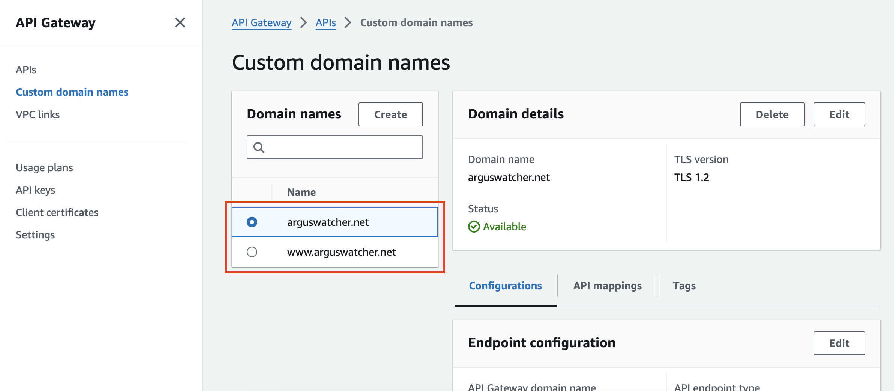
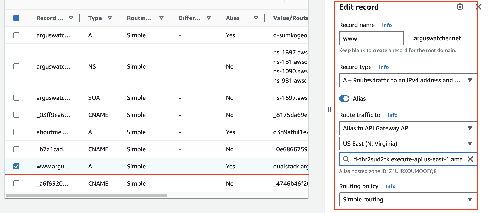

# Document - Deploy Django project on Lambda using Zappa

[Back](../README.md)

- [Document - Deploy Django project on Lambda using Zappa](#document---deploy-django-project-on-lambda-using-zappa)
  - [Clone a Django project](#clone-a-django-project)
  - [Configure Database](#configure-database)
  - [Deploy Application](#deploy-application)
  - [Configure Domain Name and SSL](#configure-domain-name-and-ssl)

---

## Clone a Django project

- To make it simple, an existing Django project is clone at the root of this project.
  - GitHub: https://github.com/simonangel-fong/Django_Simple_CRUD.git
- Collect static files
- Test locally.


---

## Configure Database

- The use of sqlite3 database might raise error.

  - In this case, use RDS MySQL instead.
  - Migrate Database

- Install package

```sh
# install mysql package
pip install pymysql
```

- Configure project’s `__init__.py` file

```py
import pymysql
pymysql.install_as_MySQLdb()
```

- Configure `settings.py`
  - can use `.cnf` file

```py
DATABASES = {
    'default': {
        'ENGINE': 'django.db.backends.mysql',
        'NAME': 'db_name',
        'HOST': 'rds_endpoint',
        'USER': 'db_username',
        'PASSWORD': 'db_pwd'
    }
}
```

---

## Deploy Application

- Install package

```sh
pip install zappa
```

- Running the Initial Setup using default parameters.

```sh
zappa init
```


- A json file is created


- package and deploy application to a stage

```sh
zappa deploy django_lambda
```


- A lambda and api have been created.


---

- Visit url
  - the initial deployment will raise an error that is caused by the allow host.


- update the allow host

```py
ALLOWED_HOSTS = ['localhost', '127.0.0.1',
                 'cged6yb30f.execute-api.us-east-1.amazonaws.com']
```

- update the stage

```sh
zappa update django_lambda
```


- Visit url.


---

## Configure Domain Name and SSL

- Create custom Domain name in API



- Update DNS record in Route 53




- Add parameters to json file

```json
{
  "stage_name": {
    "certificate_arn": "ACM_arn",
    "domain": "domain_name"
  }
}
```

- Run Certify

```sh
zappa certify django_lambda
```


- Update allow host

```py
ALLOWED_HOSTS = [
    'localhost',
    '127.0.0.1',
    'www.arguswatcher.net',
    'arguswatcher.net',
    'cged6yb30f.execute-api.us-east-1.amazonaws.com'
]
```

- Update stage

```sh
zappa update django_lambda
```


- Visit Domain name


---

[TOP](#document---deploy-django-project-on-lambda-using-zappa)
